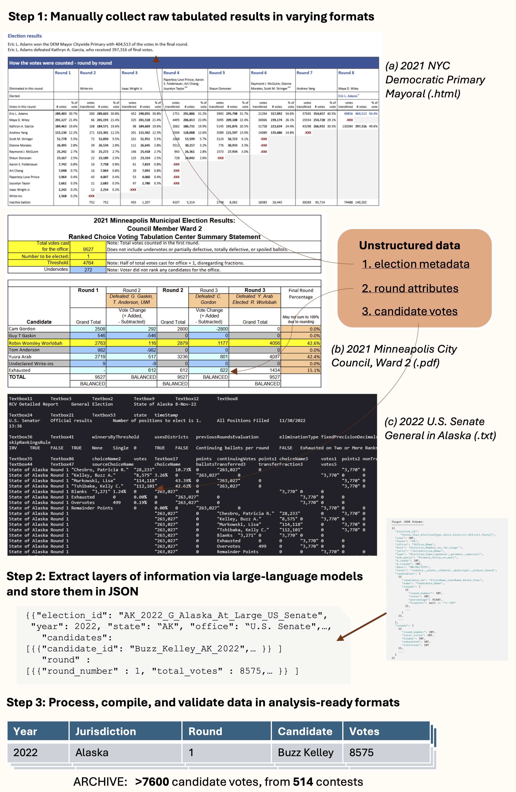

# ARCHIVE: Data Extraction and Processing Pipeline

This repository contains the data extraction, processing, and validation code used to produce the **ARCHIVE** database of standardized tabulated results from American ranked-choice voting (RCV) elections. The resulting dataset is published on [Harvard Dataverse](https://dataverse.harvard.edu/dataset.xhtml?persistentId=doi%3A10.7910%2FDVN%2FRBWU92).

## Associated Paper

> Atsusaka, Yuki; Holbrook, Jordan (2026). "ARCHIVE: A Database of Tabulated Results from American Ranked-Choice Voting Elections." Available at: [https://osf.io/preprints/socarxiv/27hgx_v1](https://osf.io/preprints/socarxiv/27hgx_v1)

This code implements the methodological procedure described in the paper: a semi-automatic pipeline based on large-language models that collects, standardizes, and stores candidate vote counts from RCV elections while instantly validating the resulting information. The final database covers over 7,600 round-level candidate vote counts from 514 American RCV elections (2004--2024).

## Method Overview

The pipeline transforms unstructured election results -- reported in widely different formats across jurisdictions and years (HTML pages, PDFs, text files) -- into a standardized, analysis-ready dataset. The process follows three steps:



**Step 1: Manually collect raw tabulated results in varying formats.** Source election reports are gathered from jurisdictional websites (e.g., NYC Board of Elections HTML pages, Alaska Division of Elections text files, Minneapolis PDF reports). These raw files are stored in `rcv_pipeline/data/source_data/`.

**Step 2: Extract layers of information via large-language models and store them in JSON.** The pipeline uses OpenAI's API to parse unstructured election text and extract three layers of structured data: (1) election metadata, (2) round attributes, and (3) candidate-level vote counts.

**Step 3: Process, compile, and validate data in analysis-ready formats.** Extracted data is cleaned, standardized, and validated. Vote transfer values are computed mathematically from round-to-round vote counts, and comprehensive quality checks ensure consistency (transfer balance, vote monotonicity, single-winner validation, etc.).

## Repository Structure

```
archive/
├── README.md                   # This file
├── figures/                    # Images and figures
│   ├── ARCHIVE_Overview.png    # Pipeline overview figure (see above)
│   └── Prompt_Picture.png      # LLM prompt illustration
├── DATA_PROVENANCE.md          # Source jurisdictions and URLs
├── LICENSE                     # MIT License
└── rcv_pipeline/               # Main pipeline code
    ├── scripts/                # Pipeline scripts (Steps 1-4)
    │   ├── 1_extract_pdfs.py       # PDF to text extraction
    │   ├── 2_extract_election_data.py  # LLM-based data extraction
    │   ├── 3_post_process.py       # Cleaning and standardization
    │   ├── 4_validate_data.py      # Data quality validation
    │   ├── run_all.py              # Run full pipeline
    │   ├── run_sample.py           # Run pipeline on a single sample
    │   ├── setup_sample.py         # Set up a new sample directory
    │   ├── combine_cleaned_datasets.py  # Merge multiple samples
    │   └── summary_stats.py        # Generate summary statistics
    ├── utils/                  # Utility functions
    └── data/
        ├── source_data/        # Raw election reports by jurisdiction
        ├── inputs/             # Pipeline input files (PDFs and text)
        ├── processing/         # Intermediate extracted data
        └── outputs/            # Final cleaned CSVs and validation reports
```

## Pipeline Output

The pipeline produces three main CSV files that constitute the ARCHIVE database:

| File | Description |
|:-----|:------------|
| `Elections_DF_cleaned.csv` | Election metadata (election ID, year, state, jurisdiction, office, etc.) |
| `Candidates_DF_cleaned.csv` | Candidate-level data per round (votes, transfers, status) |
| `Rounds_DF_cleaned.csv` | Round-level summary statistics |

Validation reports are also generated to flag any data quality issues.

## Getting Started

See [rcv_pipeline/README.md](rcv_pipeline/README.md) for detailed setup instructions, including:

- Python environment setup and dependencies
- OpenAI API key configuration
- Running the pipeline on sample or new data
- Full command reference for all scripts

## Data and Citation

The ARCHIVE dataset is available on Harvard Dataverse:

> Atsusaka, Yuki; Holbrook, Jordan, 2026, "Archive: A database of tabulated results from American ranked-choice voting elections", [https://doi.org/10.7910/DVN/RBWU92](https://doi.org/10.7910/DVN/RBWU92), Harvard Dataverse, V2.

## License

MIT License. See [LICENSE](LICENSE) for details.
